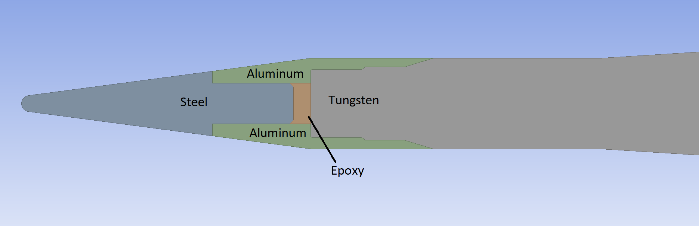

# High-Speed Dart: Conjugate Heat Transfer Simulation
**Inspired by real-world subcaliber designs**

This project models the **transient thermal response** of a multi-material, high-speed dart as it decelerates from **Mach 4 to 3.5 over 2 seconds** in standard atmosphere. Using **conjugate heat transfer (CHT)** and a custom **quasi-unsteady macro**, it captures aerodynamic heating and internal conduction through layered solids: tungsten, epoxy, aluminum, and steel.

---

## 📂 Geometry & Setup
 
- **Geometry source**: [30mm NATO APFSDS on GrabCAD](https://grabcad.com/library/30mm-nato-apfsds-1)  
> Dimensions and material layering were modified based on open-source knowledge of subcaliber darts. This model is used purely for physics-based simulation and does not reflect proprietary or classified designs.

---

## Full Geometry and Material Layout

### Full Round Geometry
The image below shows the entire geometry of the high-speed dart, including the **fins, sabot interface, and nose cone**. This model was created using open-source references and CAD estimation.


### Material Cross-Section
A centerline slice through the nose and body reveals the internal **material layering**:
- **Steel tip**
- **Aluminum shielding**
- **Epoxy bonding layer**
- **Tungsten core**

The nose cone geometry was not available in the source CAD and was constructed manually based on reasonable assumptions and public domain design characteristics.



## Simulation Method

### Quasi-Unsteady CHT Modeling

- The simulation alternates between **fluid and solid phases**, stepping time forward gradually
- A custom Java macro (`SolidFluidAlternatingMacro`) manages:
  - Activation/deactivation of physics continua
  - Time advancement logic
  - Fluid: steady runs in short bursts
  - Solid: transient heat soak integration  
- Velocity decay from Mach 4 → 3.5 modeled using:  
  ```
  M(t) = 4 * exp(-0.06615 * t)
  ```

---

### Macro Overview (Excerpt)
```java
while (currentTime < endTime) {
    fluidCont.setIsActive(true);    // fluid phase
    [solids off...]
    sim.run();

    fluidCont.setIsActive(false);   // solid phase
    [solids on...]
    timeStopCrit.setMaximumTime(...);
    sim.run();

    currentTime = sim.getSolution().getPhysicalTime();
}
```
## Temperature-Dependent Material Properties

To accurately simulate heating from Mach 4 to Mach 3.5, all materials were assigned **temperature-dependent thermal properties**, including:

### Specific Heat Capacity (Cp) and Thermal Conductivity (k)

| Material   | Cp and k behavior up to ~1000–1200°C | Notes |
|------------|--------------------------------------|-------|


| **Steel**  | Both Cp and k increase moderately with temperature.  
- Cp rises from ~450 to ~650 J/kg·K  
- k decreases slightly, from ~50 to ~25 W/m·K at high temps  
| Extended up to **1200°C** to capture steel tip behavior under high heat flux |

| **Aluminum** | Cp increases significantly with temperature  
- Cp ~900 to 1100 J/kg·K  
- k decreases from ~230 to ~150 W/m·K | Valid up to **1000°C**; above that aluminum may soften |

| **Tungsten** | Cp increases gradually  
- Cp ~130 to 150 J/kg·K  
- k slightly decreases (~170 to 140 W/m·K) | Highly stable under extreme temperatures |

| **Epoxy** | Cp increases, k remains low  
- Cp ~1100 to 1500 J/kg·K  
- k remains < 0.3 W/m·K | Epoxy thermal behavior modeled only up to ~200°C to stay below decomposition threshold |

### ⚙️ Modeling Notes
- Properties were implemented using **STAR-CCM+’s temperature-dependent material functions**
- Data sourced from public material databases and aerospace thermal reference data
- Each material curve was truncated or extrapolated only within safe physical bounds

---

## Results

## 1D Heat Transfer Validation

To validate the solver accuracy, a simple **1D conduction case** was extracted at a depth of **1 mm** into the steel tip. This was compared against the analytical solution for semi-infinite conduction using the **error function (erf)** solution:


The plot below shows excellent agreement between the numerical simulation and the analytical curve:


## Epoxy Layer Temperature Over Time

This plot shows the max **temperature evolution** inside the **epoxy bonding layer** over the full 2-second simulation window. Epoxy starts to degrade rapidly beyond 475°K


## Full Temperature Field Visualization (With and Without Mesh)

These visualizations show the **temperature field** across solid materials at 2 seconds flight time away from the stagnation.

### With Mesh Overlay
The image below includes the **solid region mesh**, helping illustrate:
- How conduction pathways evolve from the **steel tip inward**
- Layered heat transfer behavior through **aluminum**, **epoxy**, and into the **tungsten core**


### Without Mesh Overlay
The same temperature field is shown below **without mesh lines** for a clearer, presentation-quality view of thermal distribution. This version highlights:
- Temperature gradient smoothness
- Thermal interfaces between materials


---

## Temperature Evolution (2-Second Transient)

This video visualizes the **conjugate heat transfer behavior** of the dart geometry over a full **2-second flight window**, during which the Mach number decays from 4.0 to 3.5. The animation shows:

- Rapid **heating of the steel tip**
- **Boundary layer temperature rise** around the nose and body
- Gradual **conduction into aluminum, epoxy, and tungsten**
- Layer-by-layer heat propagation through the solid core


---

## ⚠️ Disclaimer
This project is intended for **open-source educational and research purposes only**. It is not a representation of any classified or proprietary system. Geometry was adapted from publicly available sources and modified extensively for thermal physics analysis.
